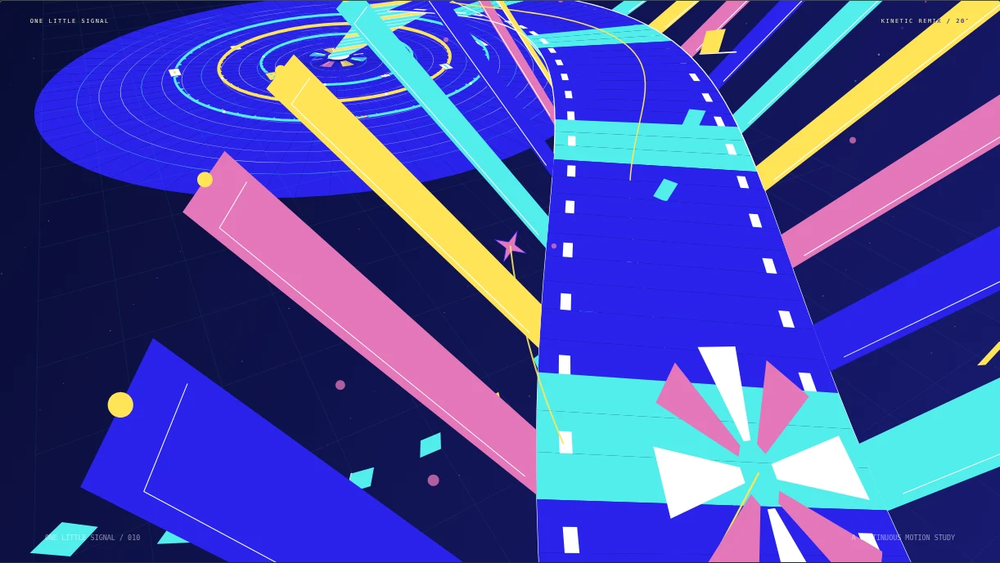
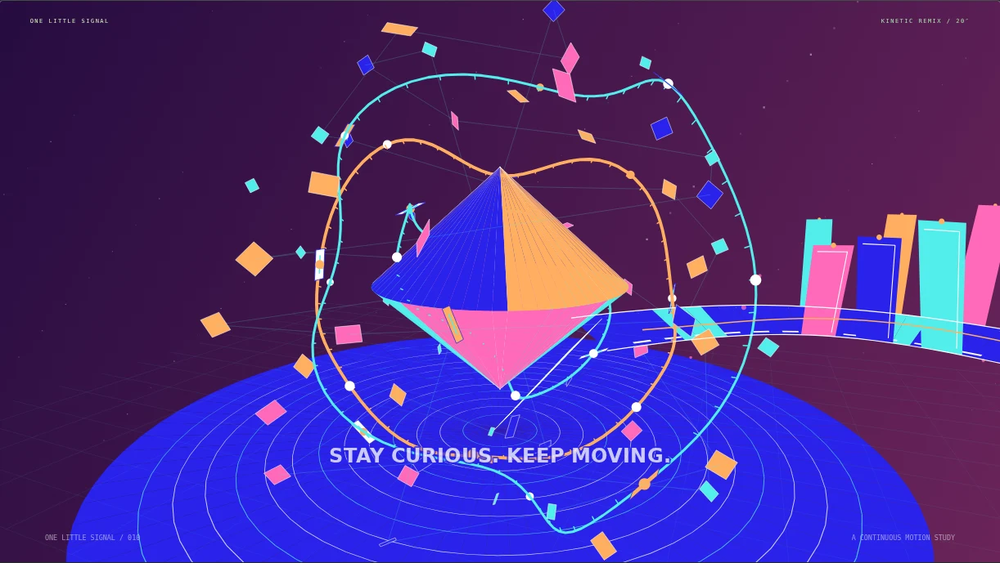

# Prism Bloom · 棱镜绽放

一束光，穿过想象的形状。一个可交互播放的 **20 秒连续几何动画网页**，搭配 132 BPM 原创合成电子乐。

光点展开成轮盘，放映机投出的面板折成空间；卡片延展为长带，两侧翼片错开翻起。镜头穿过螺旋结构，绕行花瓣装置，看它折成晶体、散开为星群。画面从浅色与粉色逐渐进入深蓝和紫色。

## 预览





## 体验

- 播放、暂停、进度拖动、重播、静音和全屏。
- 桌面宽幅与手机竖幅取景。
- 空格播放 / 暂停，左右方向键跳转一秒，`F` 全屏，`Esc` 退出。
- 首次点击播放后才发声；切到后台自动暂停。
- 音效由浏览器本地合成，无第三方音频下载或账号登录。

## 本地运行

Node.js 22.18 或更新版本：

```sh
npm ci
npm run dev
```

打开 <http://localhost:4180/>。`/study.html` 也提供同一播放器。

```sh
npm run build
npm run preview
```

构建结果位于 `dist/`，可部署到静态网站托管服务。

## 实现

原生 JavaScript + Canvas 2D 实现世界坐标、透视投影、几何形变和深度排序；Web Audio 合成节奏、旋律和动作提示音。开发与构建使用 Vite，无生产运行时依赖。

- `src/signal-journey.js`：连续相机轨迹、动作时间、面板 / 卡片 / 长带 / 轨道顶点。
- `src/signal-film.js`：图形绘制、背景变化、折纸结构、晶体与星群。
- `src/signal-sound.js`：132 BPM 配乐、动作音效、声源调度与清理。
- `src/study.js`、`src/study.css`：播放器、键盘交互与响应式布局。

所有图形由代码生成。动画按绝对时间计算，可直接拖动到任意时刻。画面使用简化深度排序，不是物理仿真或视频文件。

## 验证

启动开发服务后，在另一个终端运行：

```sh
npx playwright install chromium
npm run test:study
npm run test:continuity
npm run test:playback
```

可用 `TEST_URL=http://localhost:其他端口` 指定服务地址。

- `test:study`：可见画布、确定性跳转、播放暂停、重播、静音、全屏、手机溢出、减少动态效果设置、完整音频离线输出。
- `test:continuity`：相机位置 / 朝向连续性、折叠面板与相机间距、动作交界的像素连续性。
- `test:playback`：完整 20 秒播放、动作覆盖、实时发声调度和结束后的声源清理。

前两项检查需要开发服务器提供源码模块；完整播放检查也可对部署后的网页运行。检查使用独立无界面浏览器，截图写入被 Git 忽略的 `artifacts/`。

## 免费部署

Cloudflare Pages 的 Git 集成配置：

| 设置 | 值 |
| --- | --- |
| 生产分支 | `main` |
| 构建命令 | `npm run build` |
| 输出目录 | `dist` |
| Node 版本 | `22.18.0` |

使用 Pages 提供的 `pages.dev` 地址，无需购买域名。本项目为静态网页，不需要后端、数据库或付费服务。部署密钥只保存在本机配置中，不写入仓库。后续推送到 `main` 可触发自动构建部署。
